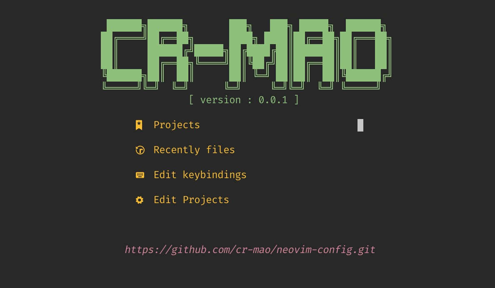

## My Neovim 



## 安装 

### ubuntu 安装neovim
```shell
sudo add-apt-repository ppa:neovim-ppa/unstable
sudo apt-get update
sudo apt-get install neovim
```
### mac 安装neovim 
```shell
brew install neovim

nvim --version # NVIM v0.8.0
```

### 字体安装
https://github.com/ryanoasis/nerd-fonts/tree/master/patched-fonts/FiraCode/Regular/complete

linux 、mac 下载 Fira Code Regular Nerd Font Complete.ttf 双击

iterm2 设置text 选择该字体即可 


### 安装 Packer.nvim 插件管理器

这一步可以跳过，项目设置了自动安装此插件，如果没成，那就手动安装下即可。

```shell
git clone --depth 1 https://github.com/wbthomason/packer.nvim\
 ~/.local/share/nvim/site/pack/packer/start/packer.nvim
 
 # ~/.local/share/nvim/site/pack/packer/start 也是插件安装位置
```


### 安装一些依赖
```shell
brew install ripgrep # 搜索插件(telescope)需要安装此依赖 
brew install fd  # 搜索插件(telescope)需要安装此依赖 
```


### 安装配置
```shell
cd $home/.config
mkdir nvim && cd nvim 
git clone https://github.com/cr-mao/neovim-config.git

```
**如果没进入插件安装界面或者网络异常 ，请手动  :PackerSync 安装下插件**
:Telescope projects


## 常用快捷键

ctrl+p  查找文件
ctrl+f  查找内容
:Telescope find_files  打开搜索文件窗口，快速打开文件。
常用的功能是全局查找，:Telescope live_grep 可以打开搜索窗口，输入内容后，结果会实时显示
ctrl+j
ctrl+k


## 其他

### packer 一些命令
- :PackerCompile： 每次改变插件配置时，必须运行此命令或 PackerSync, 重新生成编译的加载文件
- :PackerClean ： 清除所有不用的插件
- :PackerInstall ： 清除，然后安装缺失的插件
- :PackerUpdate ： 清除，然后更新并安装插件
- :PackerSync : 执行 PackerUpdate 后，再执行 PackerCompile
- :PackerLoad : 立刻加载 opt 插件


插件查找网站 ：https://neovimcraft.com


最近历史项目保存文件
:lua print(require("project_nvim.utils.path").historyfile)
